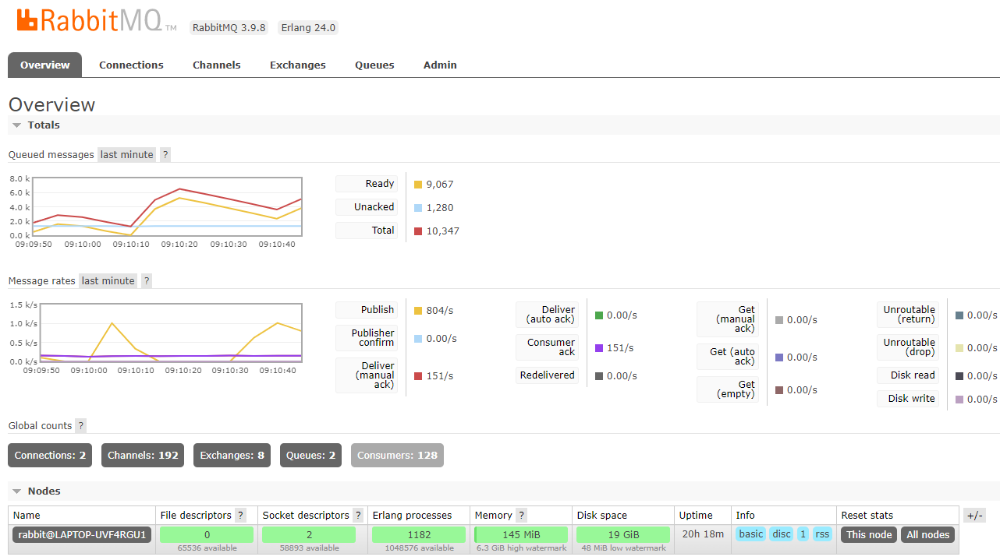
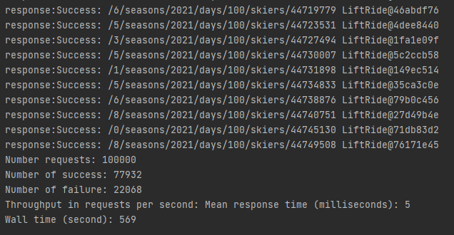

# 1.Github Repo Link

https://github.com/Johnspeanut/cs6650Assignment3

# 2. Description of Database Design

## 2.1 Overview

I create two RDSs on AWS as databases for this assignment. RDS is ralational database and is good at joining and query.I set the security group of the databases to accept TCP from anywhere. As long as server send a request to write in the databases, it will write into the databases. After the writing, the message will remove from the RabittMQ queue.

The tables in skier database and resort database share the similar fields:
|         postId        | resortId | seasonId | dayId | skierId | time  | Lift |
| --------------------- | -------- | -------- | ------|---------| ----- | ---- |
| INT AUTO_INCREAMENT   |   INT    |    INT   |  INT  |    INT  |  INT  |  INT |
Among the fields, `postId` serves as primary key.

## 2.2 Primary Packages for Database
### 2.2.1 Primary Packages
I create three packages for database:
*   jdbc: database package for skier alone
*   jdbcResort: database package for resort alone
*   consumer2DB: database package for both skier and resort
Other packages involed:
*   client: package to send http request
*   servlet: package to receive http post request and push messages into RabbitMQ queue.

### 2.2.2 Classes
#### 2.2.2.1 `DBCPDataSource` class
The class aims to connect RDS database on AWS.

### 2.2.2.2 `LiftRide`
This class is to encapsulate a lift ride record. It includes constructor, get methods, and set methods.

### 2.2.2.3 `Dao`
This class is to insert skier or resort data into the RDS databases. 

### 2.2.2.4 `Main`
This class is to pull messages from RabbitMQ queue and call Dao class method to write messages into the connected databases.

# 3. Test Runs for Skier Microservice or Resorts Microservice
*   number of databases:1
*   number of Tomcat servers: 1
*   number of channels in each Tomcat server: 64
*   number of threads in the consumer: 128
*   basicQos for each channel in consumer: 10
## 3.1 Test Runs for Skier
### 3.1.1 128-Threads in client

### 3.1.2 256-Threads in client

## 3.2 Test Runs for Resort
### 3.2.1 128-Threads in client

### 3.2.2 256-Threads in client

# 4. Test Runs with both Skier and Resorts Microservice
*   number of databases:2
*   number of Tomcat servers: 1
*   number of channels in each Tomcat server: 64
*   number of threads in the consumer: 128
*   basicQos for each channel in consumer: 10
## 4.1 128-Threads

## 4.2 256-Threads

# 5.Explanation of Mitigation Strategy
## 5.1 Comparison of results before and after applying mitigation strategy
*   number of databases:1
*   number of Tomcat servers: 1
*   number of channels in each Tomcat server: 64
*   number of threads in the consumer: 128
*   basicQos for each channel in consumer: 10
I use circuit breaker in the client side to deal with unreliabl server. In particular the client will have a rest time of 1 minute if there are 10 errors in 1 minute.
After taking circuit breaker mitigation strategy, the wall time increases a little bit. But the throughput rate increases.
### 5.1.1 128-Threads
### 5.1.1.1 Result before mitigation strategy

### 5.1.1.2 Result after mitigation strategy

### 5.1.2 256-Threads
### 5.1.2.1 Result before mitigation strategy

### 5.1.2.2 Result after mitigation strategy

## 5.2 Explanation
Circuit breaker allows client pauses sending request to server when there have been too many messages in the RabbitMQ queue. Hence the server would not be down because of its low memory, which may increase throughput rate and wall time.

